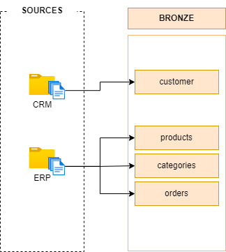

# Building the Bronze layer of our data warehouse
This layer focuses on how to ingest (extract) the raw data from the source system to our data-warehouse. No transformation required in this layer. Just load it and check the data quality.

- **Capture the data:** Ensuring that all data from the source systems is loaded into the data warehouse.
- **Preserve the raw state:** The data in the bronze layer is kept in its original form, even if it contains errors, inconsistencies, or missing values.
- **Traceability:** The bronze layer acts as a "source of truth" for the raw data, which is useful for debugging or auditing purposes.

---

*Follow these steps to create a solid bronze layer of the datawarehouse using SQL Server.*

## Data profiling
In this process we go to the source system to at the data. The source system could be a database, API, or a folder containing flat files.

In our case it is the later one, Folders (ERP and CRM) containing dataset in .csv format.

We go to each source (ERP and CRM) and take a look at each table (.csv file). We wanna see how the data looks like:
 - How many columns are in the table?
 - How many records are in the table?
 - In case of flat files, does the table has header?
 - What are the column names?
 - What are the data-types of the columns?

 We do data profiling in order to understand how to desing our table in the bronze layer. For example in the source CRM we have a .csv file name `customers.csv`, we opened it and see that the table has headers as `cust_id`, `f_name`, `l_name`.

 Then we would design our DDL like these
 ```sql
 CREATE SCHEMA bronze;

-- Drop the table if it is not null, 'U' stands for user-defined
IF OBJECT_ID('bronze.customer', 'U') IS NOT NULL
    DROP bronze.customer;
GO

 CREATE TABLE bronze.customers(
    cust_id datatype contraints,
    f_name NVARCHAR(255),
    l_name NVARCHAR(255),
 );
 ```  

 Similary, we do this with each tables for each sources dataset.

## Loading the source data into our Bronze layer
In this process we load the data from our source system into the Bronze layer of our Data Warehouse.

There are two ways to load the data:

1. **Insert:** Insert row-by-row from source to the bronze layer.
2. **Bulk insert:** Insert all the data at once from the source to the bronze layer.  

We are gonna use the second method **Bulk insert** because it is fast to load data from flat files.

```sql
BULK INSERT schema.table_name
FROM 'absolute/path/to/your/source/table'
WITH(
    FIRSTROW = 2, -- skip the first row because it is the column names not actual information
    FIELDTERMINATOR = ',', -- our .csv file use , delimeter to separate columns
    TABLOCK -- increase performance

);
```

Do this with all the datasets in each source system.

## Data Quality check
When you run this code the terminal will tell that n number of rows have been inserted, however you need to confirm that they are equal to the rows in the source system, also check if the values are stored in the proper column and columns are properly created. You can check this by writing a simple query:

```sql
-- select all columns from the top n records
SELECT TOP(n) *
FROM schema.table_name;
```
If you see that the values are not stored properly in the appropriate columns, it means that your DDL is not defined correctly, or maybe the delimiter is not correct.

## Truncate & Load
This is our load method which basically means to delete all the rows in the table and insert the data afterward.

```sql
TRUNCATE TABLE schema.table_name;

BULK INSERT schema.table_name
FROM 'absolute/path/to/your/source/table'
WITH(
    FIRSTROW = 2,
    FIELDTERMINATOR = ',',
    TABLOCK
);
```
**Why is that necessary?**

If you execute the bulk insert query again it will insert the data twice to prevent this we need to adjust our our code to follow the truncate and load method.

## Stored procedures

We are gonna use the above code frequently to load data from the source system to the bronze layer. When you a code that you use frequently you should use **stored procedures**. It is like a function in programming languages.

Just take your code and surround it like this in between `BEGIN` and `END` keyword.

```sql
CREATE OR ALTER PROCEDURE schema.procedure_name AS
BEGIN
    TRUNCATE TABLE schema.table_name;

    BULK INSERT schema.table_name
    FROM 'absolute/path/to/your/source/table'
    WITH(
        FIRSTROW = 2,
        FIELDTERMINATOR = ',',
        TABLOCK
    );
    -- code for loading data to other tables
END
```

With the stored procedures you can add **PRINT** system to beautifully log what is going on. Also useful for debugging process.

```sql
CREATE OR ALTER PROCEDURE schema.procedure_name AS
BEGIN
    PRINT "------------------------"
    PRINT "Truncating table_name"
    PRINT "------------------------"

    TRUNCATE TABLE schema.table_name;

    PRINT "------------------------"
    PRINT "Loading data to the table_name"
    PRINT "------------------------"

    BULK INSERT schema.table_name
    FROM 'absolute/path/to/your/source/table'
    WITH(
        FIRSTROW = 2,
        FIELDTERMINATOR = ',',
        TABLOCK
    );
    -- more code 
END
```

To use the stored procedure you should do this
```sql
EXEC schema.procedure_name;
```

To make it even more sophisticated, you can use variables to calculate the duration of each process, it is very simple

```sql
-- syntax: DECLARE @variable_name datatype

DECLARE @start_time DATETIME, @end_time DATETIME 
```

in the script
```sql
CREATE OR ALTER PROCEDURE schema.procedure_name AS
BEGIN
    DECLARE @start_time DATETIME, @end_time DATETIME, @batch_start_time DATETIME, @batch_end_time DATETIME

    SET @batch_start_time = GETDATE()
    PRINT "========================"
    PRINT "Loading the Bronze layer"
    PRINT "========================"

    SET @start_time = GETDATE()
    PRINT "--------------------------"
    PRINT ">>> Truncating table_name"
    PRINT "--------------------------"

    TRUNCATE TABLE schema.table_name;
    PRINT "-------------------------------"
    PRINT "Loading data to the table_name"
    PRINT "-------------------------------"

    BULK INSERT schema.table_name
    FROM 'absolute/path/to/your/source/table'
    WITH(
        FIRSTROW = 2,
        FIELDTERMINATOR = ',',
        TABLOCK
    );

    SET @end_time = GETDATE()

    PRINT ">>> Load duration:" + CAST(DATEDIFF(second, @start_time, @end_time) AS NVARCHAR) + 'seconds.'

    -- more code 
    SET @batch_end_time = GETDATE()
    PRINT ">>> Total load duration:" + CAST(DATEDIFF(second, @batch_start_time, @batch_end_time) AS NVARCHAR) + 'seconds.'

END

```

**Try & Catch**

Try…Catch, ensure error handling, and data integrity, and help easier debugging. The SQL runs the `Try` block and if encounters any error it runs the `Catch` block. 

It is very simple to implement add `BEGIN TRY` right below the `BEGIN` of our procedure and `END TRY` right above the `END` of our procedure, then below the END TRY add `BEGIN CATCH` some code to run END CATCH.

```sql
CREATE OR ALTER PROCEDURE schema.procedure_name AS

BEGIN
    BEGIN TRY
        -- the entire script runs
    END TRY
    BEGIN CATCH
        -- if encounter error the below code run
        PRINT '========================================='
		PRINT 'ERROR OCCURED DURING LOADING BRONZE LAYER'
		PRINT 'Error Message' + ERROR_MESSAGE();
		PRINT 'Error Message' + CAST (ERROR_NUMBER() AS NVARCHAR);
		PRINT 'Error Message' + CAST (ERROR_STATE() AS NVARCHAR);
		PRINT '========================================='

    END CATCH
END
```
## Create a Dataflow diagram
 This is the dataflow (data lineage) from the source to the bronze layer

 


## Commit to your GitHub
You have successfully build the bronze layer of your data-warehouse you can now go and create a github repository and make your first commit!

## Next step
Building the silver layer of our datawarehouse.