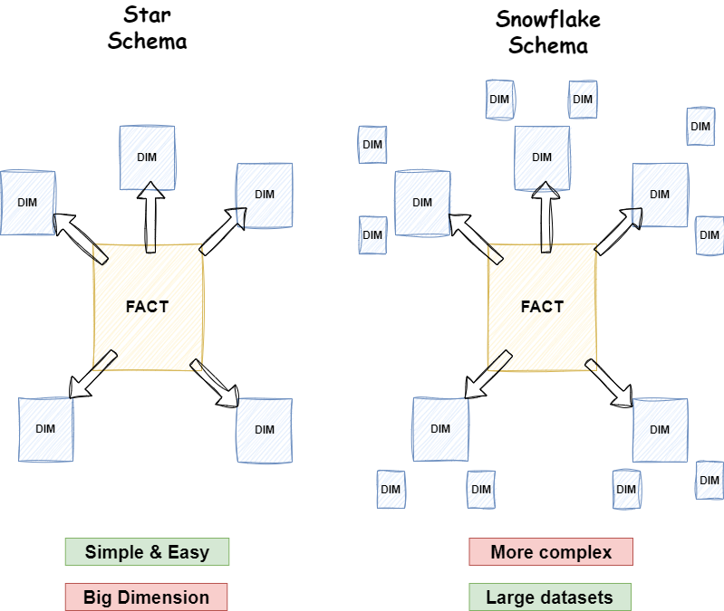
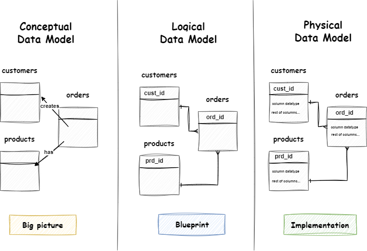
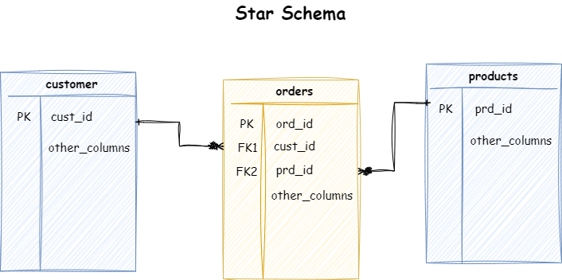
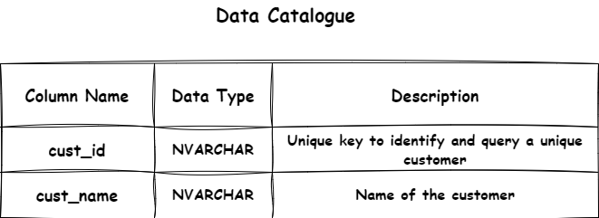
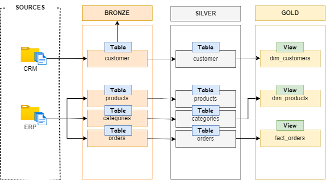

# Building the Gold layer of our data warehouse
This layer focuses on how to make data excessible to management and analysts to make better decisions.

- **(Analyzing) Explore & undestand the business objects:** Understand which tables two or more tables are basically same just some table have additional information. eg. in the source CRM we have customer table and we also have customer_location table in ERP that has some additional information such as address, city, country, etc. So, basically they are same object we label them customer. Similarly, we do it products if we have it. Check this picture to understand 
- **(Coding) Data integration:** 
    - When we labelled the similar object it is time to joined them to make it one single table.
    - Rename the column to more descriptive name.
    - Decide the table is fact or a dimension table.
- **(Validating) Data integration checks:** Check if everything went well and the joined worked as expected.
- **Documenting:** 
    - Create a data catalogue.
    - Documenting and versioning on GitHub.

---

*Follow these steps to create a solid gold layer of the datawarehouse using SQL Server.*

## Data modelling
Data modeling is the process of designing the structure of a database to represent how data will be stored, organized, and accessed.

## Types of Data modelling
There are two popular ways to create our data-model:
1. Star schema
2. Snowflake schema



**When to Use Which?**

- **Star Schema:** This is best for simplicity and performance in most analytical scenarios.
- **Snowflake Schema:** This is best when storage space is a concern or when dimensions are highly normalized.

For this project we will go with star schema as it is easier to construct and also we don't have storage concern.

## Conceptual, Logical, and Physical data model



## Build a star schema


## Build a data catalogue
A data catalog is a document or a table that describe each columns of a table.




## Create a Dataflow diagram
 This is the dataflow (data lineage) from the source to the bronze layer

 

## Views
In the gold layer instead of creating a table we often create views

```sql

IF OBJECT_ID('gold.dim_products', 'V') IS NOT NULL
    DROP VIEW gold.dim_products;
GO

CREATE VIEW schema.dim_products AS
SELECT
 *
FROM silver.products; 
```

## Commit to your GitHub
You have successfully build the gold layer of your data-warehouse you can now go and create a github repository and make your first commit!

## Congratulations!!!
Your data warehouse project has been successfully completed. It is ready to be used by the data analyst and data scientist to discover patterns, and insights to make better decisions.