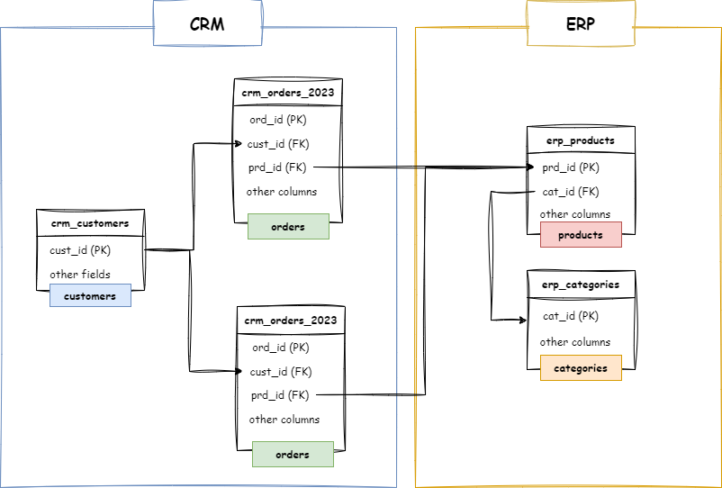
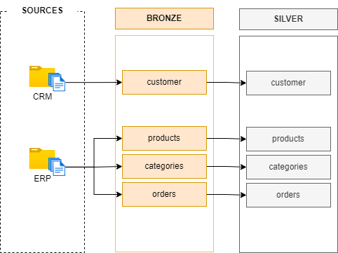

# Building the Silver layer of our data warehouse

*Follow these steps to create a solid silver layer of the datawarehouse using SQL Server.*

## Explore & Understand the data

The silver layer is where the real work begins. Here, the focus shifts to *cleaning, transforming, and standardizing* the data so that it becomes usable for analysis and reporting. This is why exploring and understanding the data is so important at this stage. Here’s why:

1. **Data Quality Issues:**
    - The raw data in the bronze layer often contains errors, inconsistencies, and missing values.
    - In the silver layer, you need to identify and fix these issues to ensure the data is accurate and reliable.
    - For example:
        - Removing duplicates.
        - Handling null or missing values (try to think if there are any ways to fill that null value, for example let suppose you have a column `total` which has a null value, however you have 2 more column `price` and `quantity` which are not null you can simply calculate the `total=price*quantity`. However if there is no way just simple replace null with `'unknown'` and `0` for string and numeric column respectively.).
        - Fixing invalid or inconsistent data (e.g., negative sales amounts).
2. **Data Standardization:**
    - Different source systems may use different formats, codes, or conventions for the same type of data.
    - In the silver layer, you need to standardize the data so that it follows a consistent format across the entire data warehouse.
    - For example:
        - Converting all dates to a standard format (e.g., YYYY-MM-DD).
        - Mapping abbreviations to full names (e.g., "M" → "Male", "F" → "Female").
3. **Preparation for the Gold Layer:**
- The silver layer acts as a bridge between the raw data in the bronze layer and the fully refined, business-ready data in the gold layer.
- By cleaning and standardizing the data in the silver layer, you ensure that the gold layer can focus on delivering insights rather than fixing data quality issues.

## How to explore & understand the data?
These are some of the techniques to explore and understand the data:
1. **Data Profiling:**
    - Analyze the structure, content, and quality of the data.
    - For example:
        - Check for number of records and columns, null values, duplicates, and outliers.
        - Examine the distribution of values in each column.
2. **Data Validation:**
    - Verify that the data meets certain rules or constraints.
    - For example:
        - Ensure that all dates are within a valid range.
        - Check that numeric values (e.g., sales amounts) are positive.
3. **Data Relationships:**
    - Understand how different tables and columns relate to each other.
    - For example:
        - Identify foreign keys and primary keys.
        - Check for referential integrity (e.g., ensure all customer IDs in the sales table exist in the customer table).
4. **Business Context:**
    - Work with business stakeholders to understand the meaning and importance of the data.
    - For example:
        - What does each column represent?
        - What are the business rules that apply to the data?

## Draw a Data Integration diagram
This is to make our life easier when integrating related data from multiple sources. For example suppose we have customer information in source CRM and additional customer information is in source ERP we label each table customer to identify which tables are related to integrate into one single table in gold layer.

It should look like this:

## Metadata columns

Metadata is data about data. It provides additional context about the data. Columns like:

- **loaded_at:** When was the data loaded.
- **source:** Where did the data come from.

These columns are used for *tracking, auditing, and debugging* purposes, and they help improve the traceability and manageability of the data in the data warehouse.

## Data transformation - cleaning the data
This is the most important process in the silver layer of our database. In this step go over each column of every table in our bronze layer and inspect what inconsistencies, descrepencies, the column have and try to fix them. 

Common data transformation for different datatypes:

- **String:**
    - Remove white spaces using TRIM()
    - Correct inconsistent casing using UPPER() or LOWER()
    - Convert abbreviations to descriptive value (`M` -> `Male`) using CASE statement
    - Extract substring from a big string eg. let say you have a product_key like this 'AC-BC-BC-M005' however the first 5 character is category_id use SUBSTRING() to extract that string
- **Numeric:**
    - Handle invalid value (eg. columns price should not have negative values) using CASE statement
    - Handle missing values (null) using COALECSE() or ISNULL()
- **Date:**
    - Ensure that the start_date is less than end_date
    - Handle invalid values (eg. columns like `birthday`, `joined_on`, `hired_on` should not have future dates or vice-versa date should not be old based on the nature of the dataset for example instagram should have a user born in 1800)

Other transformation such as:
- deduplication
- ordering
- filtering
- aggregations
- derived columns (create column that derive some value from an existing column, eg. joined_date `2025-01-01' -> joined_year '2025')
- data enriching (create column that makes analyst live easier, eg. we have `price` and `quantity` we create `total` column price*quantity)

## Create a Dataflow diagram
 This is the dataflow (data lineage) from the source to the silver layer

 

## Commit to your GitHub
You have successfully build the silver layer of your data-warehouse you can now go and create a github repository and make your first commit!

## Next step
Building the gold layer of our datawarehouse.