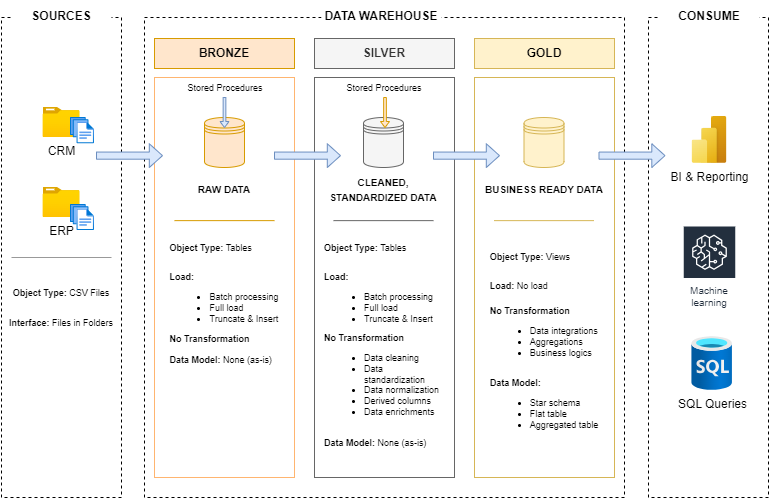

# Data Warehouse Project from scratch using SQL

In this project we are gonna build a modern data-warehouse using SQL Server from the ground up, it is gonna be amazing!!!

## Project Purpose

This repository serves as a comprehensive guide for building data warehouses in SQL Server. While it includes specific code implementations, the principles, architecture, and methodologies presented here can be applied to any SQL Server data warehouse project. This guide aims to provide both theoretical knowledge and practical examples that data engineers can adapt to their specific business requirements.

## Project requirements

### Building a data-warehouse

**Objective**

The objective is to build a solid data-warehouse to ensure that the managemant makes better and informed decisions

**Specification**

- **Data source:** Import data from two data sources (ERP and CRM) provided as a .csv files. 
- **Data quality:** Clean, transform and resove all the data quality issues (deduplication, standardization, handling missing and invalid values, etc).
- **Data integration:** Combine both sources into a single, user-friendly data-model designed for analytical purpose. 
- **Scope:** Focus on the latest dataset only, no historization is required for this project.
- **Documentation:** Clearly document the data model to support business stakeholders and analytics teams.

## Datawarehouse Architecture
In this project we are gonna use **Medallion Architecture** to design our data-warehouse. Note that there are other options such as *inmon, kimball, and data-vault*. However, the medallion architecture is the most intuitive and used by big companies.



1. **Bronze Layer:** Stores raw data as-is from the source systems. Data is ingested from CSV Files into SQL Server Database.
2. **Silver Layer:** This layer includes data cleansing, standardization, and normalization processes to prepare data for analysis.
3. **Gold Layer:** Houses business-ready data modeled into a star schema required for reporting and analytics.

## Project Overview
This project consists including but not limited to:
- **Data Architecture:** Designing a Modern Data Warehouse Using Medallion Architecture Bronze, Silver, and Gold layers.
- **ETL piplines:** Extracting, transforming, and loading data from source systems into the warehouse.
- **Data modelling:** Developing fact and dimension tables optimized for analytical queries.

### Here are the steps for creating a data warehouse:
1. **Requirements Analysis:**
    - Analyze and understand the requirements for the data warehouse.
2. **Design Data Architecture:**
    - Choose a data management approach.
    - Design the architecture layers.
    - Draw the data architecture using tools like Draw.io.
3. **Project Initialization:**
    - Create detailed project tasks (e.g., using Notion).
    - Define project naming conventions.
    - Set up a Git repository and prepare its structure.
    - Create the database and schemas.
4. **Build Bronze Layer:**
    - Analyze source systems.
    - Code the data ingestion process.
    - Validate data completeness and perform schema checks.
    - Document the data flow using tools like Draw.io..
    - Commit the code to the Git repository.
5. **Build Silver Layer:**
    - Explore and understand the data.
    - Document the data integration process.
    - Perform data cleansing.
    - Validate data correctness.
    - Extend the data flow documentation.
    - Commit the code to the Git repository.
6. **Build Gold Layer:**
    - Explore business objects.
    - Code the data integration process.
    - Validate data integration.
    - Document the data model (e.g., star schema) and create a data catalog.
    - Extend the data flow documentation.
    - Commit the code to the Git repository.

After understanding the requirements and objectives of our project carefully we are gonna build our datawarehouse like this:

- We are gonna build a Data Warehouse using the Medallion Architecture.
- We are gonna use snake casing for naming our tables, columns, and other objects like stored procedures.

## Dataset Information
The dataset required for this project is too large to be uploaded directly to GitHub due to the platform's file size limitations (maximum 20MB per file). Therefore, the dataset can be downloaded from the following **Google Drive** link:

[https://drive.google.com/drive/folders/1rrZWlnXSFTZMz0s4z7fpfBYzrBDH7Z3_?usp=drive_link](https://drive.google.com/drive/folders/1rrZWlnXSFTZMz0s4z7fpfBYzrBDH7Z3_)

### Instructions for Setting Up the Dataset
1. Download the `datasets` folder from the provided Google Drive link.
2. After downloading, ensure that the `crm` and `erp` directories are placed inside the `datasets` directory of this project.

The directory structure should look like this:

```
├── docs/                       # Documentation files
│   └── datawarehouse_architechture.png
├── scripts/
│   ├── bronze/                 # Scripts for bronze layer implementation
│   ├── silver/                 # Scripts for silver layer implementation
│   └── gold/                   # Scripts for gold layer implementation
├── dataset/
│   ├── crm/                    # Source CSV files
│   └── erp/                    # Source CSV files
├── test/                       # Some tests
└── readme.md                   # Project documentation
```


## About me
I am **Ata S. Shaikh** an experienced Data scientist and Data engineer. I have a Master's degree in Artificial Intelligence from the prestigious university The University of Mumbai. 

I have strong background in Data Engineering, Data Science and Machine learning. I solid understanding of Python and all it's libraries for data engineering and machine learning. I am proficient in Advanced SQl queries, have ample knowledge of business intelligence tools like Tableau PowerBI and Excel. 

Additionaly I am an excellent communicator capable of communicating complex information in digestable format to technical as well as non-technical stakeholders.

If you need any guidance feel free to connect with me LinkedIn: https://www.linkedin.com/in/theatashaikh


